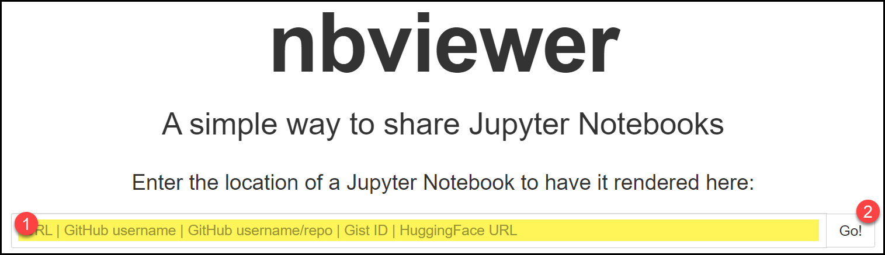

# README.md

<strong>Data Dunkers Start <a href="Data-Dunkers-README.md">HERE</a>!</strong>

---

Welcome! 

My goal here is to share things I learn about data analysis using Python. The majority of the files I include will likely be Jupyter Notebooks because I like the inherent interactivity Jupyter Notebooks provide, the integration with Markdown (making documentation of the code so much easier), and the ability to easily "chunk" the code to aid in the teaching of how the code works.

# Table of Contents
- [What's New?](#whats-new)
- [Problems Viewing?](#problems-viewing)
- [Miscellaneous](#miscellaneous)
- [Projects](#projects)
- [Data-Dunkers](#data-dunkers)

# What's New? 

+ Links have been created between the BADS (Basketball and Data Science) tutorials
+ "PS43" has been changed to "Data Dunkers"
+ I've split the "import data from" demo into multiple files:
  + [Data in the notebook](Demos/where-can-we-get-data-from-internal.ipynb)
  + [CSV](Demos/where-can-we-get-data-from-csv.ipynb)
  + [Excel](Demos/where-can-we-get-data-from-excel.ipynb)
  + [Webpage](Demos/where-can-we-get-data-from-webpage.ipynb)
  + [Google Sheet](Demos/where-can-we-get-data-from-google-sheet.ipynb)
+ Added [dealing-with-percent-symbols-and-y-scaling.ipynb](Demos/dealing-with-percent-symbols-and-y-scaling.ipynb) which demonstrates how to deal with percent symbols in your input file and how to scale the y-axis on your plot.
+ Added [cheatsheet.md](cheatsheet.md).
+ Added an [activity](Demos/bb-vs-vb-activity) where the students did 10 free throws with a basketball and then with a volleyball and tracked their success
+ Added [02-01-bar-graphs.ipynb](BADS/02-visualize/02-01-bar-graphs.ipynb), [02-02-scatter-plots.ipynb](BADS/02-visualize/02-02-scatter-plots.ipynb), and [02-03-pie-charts.ipynb](BADS/02-visualize/02-03-pie-charts.ipynb) to the "BADS" (Basketball and Data Science) folder.
+ Added [labpython-continents-population.ipynbel](Demos/python-continents-population.ipynb), a bonus demonstration to see how Python can be used to plot multiple charts in a loop.
+ Added [callysto-delete-folder.ipynb](Utils/callysto-delete-folder.ipynb), a utility which can be uploaded to Callysto to delete a folder and all its contents. USE WITh CAUTION!
+ Added [01-01-columns.ipynb](BADS/01-Intro/01-01-columns.ipynb),[01-02-filtering-data.ipynb](BADS/01-Intro/01-02-filtering-data.ipynb), and [01-03-sorting-data.ipynb](BADS/01-Intro/01-03-sorting-data.ipynb) to the "BADS" (Basketball and Data Science) folder.
Added [clear-jupyter-outputs.py](Utils/clear-jupyter-outputs.py), a utility to clear the outputs from all Jupyter Notebooks in a given folder. Thanks to [David Hay](https://github.com/misterhay) for the [original](https://gist.github.com/misterhay/62f2dbfffd9b66288d54b25607a8717a) of this. 
+ Added [player-files-from-folder.py](Utils/player-files-from-folder.py), a quick utility to convert a list of player CSV files to a list.
+ Added a utility to create a table of contents at the top of a Jupyter Notebook. This experiment was ultimately a [bust](Utils/create-jupyter-notebook-toc/README.md), but worth trying. Hopefully someone else can get it working! 
+ Added [where-can-we-get-data-from-internal.ipynb](Demos/where-can-we-get-data-from-internal.ipynb) that is a good starting point for learning the different places can be imported from and then plotting the data using `plotly.express`. ([Callysto](https://hub.callysto.ca/jupyter/hub/user-redirect/git-pull?repo=https://github.com/pbeens/Data-Analysis&branch=main&subPath=Demos/where-can-we-get-data-from-internal.ipynb&depth=1) | [Colab](https://githubtocolab.com/pbeens/Data-Analysis/blob/main/Demos/where-can-we-get-data-from-internal.ipynb) | [NBViewer](https://nbviewer.org/github/pbeens/Data-Analysis/blob/main/Demos/where-can-we-get-data-from-internal.ipynb))
+ Added [jupyter-notebook-demo.ipynb](Demos/jupyter-notebook-demo.ipynb), used to introduce Jupyter Notebooks. ([Callysto](https://hub.callysto.ca/jupyter/hub/user-redirect/git-pull?repo=https://github.com/pbeens/Data-Analysis&branch=main&subPath=Demos/jupyter-notebook-demo.ipynb&depth=1) | [Colab](https://githubtocolab.com/pbeens/Data-Analysis/blob/main/Demos/jupyter-notebook-demo.ipynb) | [NBViewer](https://nbviewer.org/github/pbeens/Data-Analysis/blob/main/Demos/jupyter-notebook-demo.ipynb))
+ Added [csv-to-html.py](Utils/csv-to-html.py), a simple utility that can be used to convert a **CSV file** to an **HTML table**.
+ Added [markdown-tables.md](Demos/markdown-tables.md) to show how tables in Markdown are created. 
+ Added a [code snippet](Utils/code-snippets/image.md) to show how to **insert images into Markdown** when they need to be resized or centered.
+ Added [find_table_index.ipynb](Utils/find_table_index.ipynb), a utility that checks for the existence of a table name at a given URL and returns the index of that table. This is useful when scraping data from tables on webpages. You can run this utility directly on Colab [here](https://githubtocolab.com/pbeens/Data-Analysis/blob/main/Utils/find_table_index.ipynb).
+ Added [ssl-fix.ipynb](Utils/ssl-fix.ipynb) a fix I occasionally need to use when accessing Google Sheets. Simply copy-and-paste this code into your program before reading in the Google Sheet. Note: read the comments in the notebook. There is a fix that I disovered which should make this code obsolete.
+ Added [clipboard-download.ipynb](Utils/clipboard-download/clipboard-download.ipynb) to demonstrate how to use `pd.read_clipboard()` when `pd.read_html()` won't work. The program also saves the data to a CSV file. 
+ Added "What are some good websites for open data?" to the [FAQs](FAQ.md)
+ I've updated the [github-to-notebook-links](Utils/github-to-notebook-links.py) utility to now also include Callysto, so you can convert any Jupyter notebook (*.ipynb) on GitHub to links that can be opened on Callysto, Colab, or NBViewer. You can run this utility directly on Colab [here](https://colab.research.google.com/drive/12LdduTNAtMwC3oNohv8Y7dFkuJiPYFOd?usp=sharing).
+ I've added [team-roster.ipynb](Sports/NBA/team-roster.ipynb) which uses nba_api data to print some player information for the Toronto Raptors.
+ I've added two glossaries for the nba_api data: [player-stats-glossary.md](Sports/NBA/player-stats-glossary.md) and [team-roster-glossary.md](Sports/NBA/team-roster-glossary.md).
+ I've added [Birth Months](Misc/Birth-Months.ipynb), a program which imports the data from *Google Sheets* and plots a histogram of the birth months.
+ I've added an [FAQ](FAQ.md#how-do-i-create-requirementstxt-for-python) related to the requirements.txt file, which can be used for installing all the required libraries in Python.
+ I've created a [Canadian Population Bar Chart notebook](Wikipedia/Canadian-Population-Barchart.ipynb) ([Colab](https://githubtocolab.com/pbeens/Data-Analysis/blob/main/Wikipedia/Canadian-Population-Barchart.ipynb) | [NBViewer](https://nbviewer.org/github/pbeens/Data-Analysis/blob/main/Wikipedia/Canadian-Population-Barchart.ipynb)) to show how to extract data from a table on a [page](https://en.wikipedia.org/wiki/Population_of_Canada_by_province_and_territory) on Wikipedia. 
+ I've created a Python [utility](Utils/github-to-notebook-links.py) which which will create the Callysto, Colab, and NBViewer links to let you view and/or experiment with a Jupyter notebook that's on GitHub. Look for it in the [Utils](Utils) folder or run it directly [here](https://colab.research.google.com/drive/12LdduTNAtMwC3oNohv8Y7dFkuJiPYFOd?usp=sharing).

# Problems Viewing?

Note: if you're having an issue with a Jupyter notebook not displaying in GitHub, go to https://nbviewer.org/ and paste in the URL of the notebook. 

    

Alternatively, you can display the notebook in **Google Colab** by changing the github part of the URL to githubtocolab. https://github.com/ would become https://githubtocolab.com/. 

I have written a utility which will take a GitHub ipynb URL and convert it for use with Colab and NBViewer. You can download the file from [here](Utils/github-to-notebook-links.py) or run it from [here](https://colab.research.google.com/drive/12LdduTNAtMwC3oNohv8Y7dFkuJiPYFOd?usp=sharing).

# Miscellaneous 

+ [FAQs](FAQ.md)
+ If you need to quickly code some Python, why not try out JupyterLite? 
 

# Projects 

(not up to data)

+ [Sports/NBA/team-roster.ipynb](Sports/NBA/team-roster.ipynb) — Open in [Callysto](https://hub.callysto.ca/jupyter/hub/user-redirect/git-pull?repo=https://github.com/pbeens/Data-Analysis&branch=main&subPath=Sports/NBA/team-roster.ipynb&depth=1) | [Colab](https://githubtocolab.com/pbeens/Data-Analysis/blob/main/Sports/NBA/team-roster.ipynb) | [NBViewer](https://nbviewer.org/github/pbeens/Data-Analysis/blob/main/Sports/NBA/team-roster.ipynb). The program uses the `nba_api.stats.endpoints` package to access the NBA website and get the roster information for the Toronto Raptors. It then uses the `pandas` library to manipulate and display the data in a tabular format. It uses various pandas attributes, methods, and functions to select, convert, sort, and print the columns of interest. The output shows the names and jersey numbers of the Raptors players in order of their jersey numbers.
+ [Misc/Birth-Months.ipynb](Misc/Birth-Months.ipynb) — Open in 
  [Callysto](https://hub.callysto.ca/jupyter/hub/user-redirect/git-pull?repo=https://github.com/pbeens/Data-Analysis&branch=main&subPath=Misc/Birth-Months.ipynb&depth=1) | [Colab](https://githubtocolab.com/pbeens/Data-Analysis/blob/main/Misc/Birth-Months.ipynb) | [NBViewer](https://nbviewer.org/github/pbeens/Data-Analysis/blob/main/Misc/Birth-Months.ipynb). This Python program uses `pandas` and `matplotlib.pyplot` to read data from a public **Google Sheet**, create a **histogram** of the data in the birth month column, and save the histogram as an **image file**. The program also uses comments to document the code and explain what each line or block of code does. 
+ [Wikipedia/Canadian-Population-Barchart.ipynb](Wikipedia/Canadian-Population-Barchart.ipynb) — Open in [Callysto](https://hub.callysto.ca/jupyter/hub/user-redirect/git-pull?repo=https://github.com/pbeens/Data-Analysis&branch=main&subPath=Wikipedia/Canadian-Population-Barchart.ipynb&depth=1) | [Colab](https://githubtocolab.com/pbeens/Data-Analysis/blob/main/Wikipedia/Canadian-Population-Barchart.ipynb) | [NBViewer](https://nbviewer.org/github/pbeens/Data-Analysis/blob/main/Wikipedia/Canadian-Population-Barchart.ipynb). This program reads in Canadian population data from a table on a page in **Wikipedia**. It showcases how to read in the data, clean it up so it can be plotted, and then plots two **bar charts**.

# Data-Dunkers

My recommendations and resources for the Data-Dunkers data analysis initiative can be found [here](Data-Dunkers-README.md).
